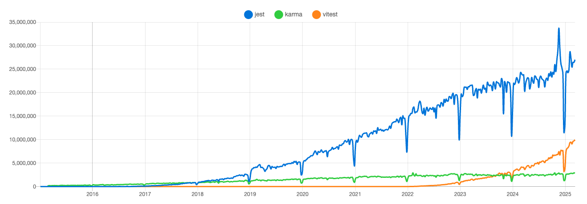

# Kiểm thử tự động trong front-end
## 1. Giới thiệu về kiểm thử tự động trong front-end
### 1.1. Kiểm thử tự động là gì?
Kiểm thử tự động là quá trình sử dụng các công cụ và framework để viết và chạy các kịch bản kiểm thử, thay vì kiểm thử bằng tay. Mục đích chính là giúp tăng tốc phát triển, giảm thiểu lỗi và đảm bảo chất lượng code.

### 1.2. Tại sao cần kiểm thử tự động?
- Giảm thiểu lỗi: Kiểm thử tự động giúp phát hiện lỗi sớm hơn, giảm thiểu rủi ro lỗi xảy ra ở production.
- Tiết kiệm thời gian: Kiểm thử tự động giúp tiết kiệm thời gian kiểm thử, giúp team phát triển tập trung vào việc phát triển sản phẩm.
- Tăng chất lượng: Kiểm thử tự động giúp đảm bảo chất lượng code, giúp team tự tin hơn khi phát triển sản phẩm.
- Cải thiện maintainability: Kiểm thử tự động giúp dễ dàng maintain test case, giúp team dễ dàng thêm mới, sửa lỗi test case.

### 1.3. Các loại kiểm thử tự động
- Unit test: Kiểm thử từng phần nhỏ nhất của code, thường là từng function hoặc class/component.
- Integration test: Kiểm thử tích hợp giữa các phần của hệ thống, kiểm thử sự tương tác giữa các module, component, API.
- End-to-end test: Kiểm thử toàn bộ hệ thống, mô phỏng giống như cách người dùng sử dụng sản phẩm thật.
- Snapshot test: Kiểm thử sự thay đổi của UI, bằng cách lưu trữ và so sánh output của các component, giúp phát hiện có sự thay đổi không mong muốn.

### 1.4. Công cụ kiểm thử tự động phổ biến
#### 1.4.1. Unit test
- [Jest](https://jestjs.io/): Jest là một framework kiểm thử JavaScript phổ biến, được Facebook phát triển.
- [Vitest](https://vitest.dev/): Vitest là một công cụ kiểm thử JavaScript mới, phiên bản nhanh hơn của Jest, tích hợp tốt với Vite.
- [Karma](https://karma-runner.github.io/): Karma là một công cụ kiểm thử JavaScript giúp chạy test case trên nhiều trình duyệt (deprecated).
- [Mocha](https://mochajs.org/): Mocha là một framework kiểm thử JavaScript linh hoạt, hỗ trợ nhiều loại test case.
- [Chai](https://www.chaijs.com/): Chai là một thư viện kiểm thử JavaScript giúp viết test case dễ đọc, dễ bảo trì.

#### 1.4.2. Integration test
- [Testing Library](https://testing-library.com/): Testing Library là một bộ công cụ kiểm thử JavaScript giúp viết test case dễ đọc, dễ bảo trì.
- [@vue/test-utils](https://next.vue-test-utils.vuejs.org/): Vue Test Utils là một thư viện kiểm thử cho Vue.js, giúp viết test case cho Vue component.
- [@nuxt/test-utils](https://nuxt.com/docs/getting-started/testing): Nuxt Test Utils là một thư viện kiểm thử cho Nuxt.js, giúp viết test case cho Nuxt component.
- [Jasmine](https://jasmine.github.io/): Jasmine là một framework kiểm thử JavaScript linh hoạt, hỗ trợ nhiều loại test case. Được sử dụng phổ biến trong các dự án Angular.

#### 1.4.3. End-to-end test
- [Playwright](https://playwright.dev/): Playwright là một công cụ kiểm thử end-to-end JavaScript giúp viết test case cho nhiều trình duyệt khác nhau.
- [Cypress](https://www.cypress.io/): Cypress là một công cụ kiểm thử end-to-end JavaScript phổ biến, giúp viết test case dễ dàng, chạy test case nhanh chóng.
- [Puppeteer](https://pptr.dev/): Puppeteer là một công cụ kiểm thử end-to-end JavaScript giúp tự động hóa các thao tác trên trình duyệt.
- [Nightwatch](https://nightwatchjs.org/): Nightwatch là một công cụ kiểm thử end-to-end được xây dựng trên [Selenium WebDriver](https://www.npmjs.com/package/selenium-webdriver). Nó hỗ trợ nhiều trình duyệt nhất, bao gồm cả trình duyệt di động. Tuy nhiên tốc độ sẽ chậm hơn so với Cypress và Playwright.
- [WebdriverIO](https://webdriver.io/): WebdriverIO là một automation test framework cho web và mobile dựa trên giao thức WebDriver.

#### 1.4.4. Snapshot test
- [Jest Snapshot Testing](https://jestjs.io/docs/snapshot-testing): Jest hỗ trợ snapshot test, giúp lưu trữ và so sánh output của các component.
- [Vitest Snapshot](https://vitest.dev/guide/snapshot): Vitest hỗ trợ snapshot test, giúp lưu trữ và so sánh output của các component.

### 1.5. Tổng kết
- Kiểm thử tự động là một phần quan trọng trong quy trình phát triển phần mềm, giúp tăng tốc độ phát triển, giảm thiểu lỗi và đảm bảo chất lượng code. Việc chọn lựa công cụ kiểm thử phù hợp giúp team phát triển hiệu quả hơn, giảm thiểu thời gian kiểm thử và tăng chất lượng sản phẩm.
- Khi nào dùng unit test, khi nào dùng integration test, khi nào dùng end-to-end test? phụ thuộc vào yêu cầu của dự án, cũng như đặc điểm của từng loại test case. Việc kết hợp nhiều loại kiểm thử giúp đảm bảo chất lượng sản phẩm tốt nhất.

| Loại kiểm thử | Use case |
|---------------|----------|
| Unit test     | Kiểm thử từng phần nhỏ nhất của code, thường là từng function hoặc class/component. |
| Integration test | Kiểm thử tích hợp giữa các phần của hệ thống, kiểm thử sự tương tác giữa các module, component, API. |
| End-to-end test | Kiểm thử toàn bộ hệ thống, mô phỏng giống như cách người dùng sử dụng sản phẩm thật. |
| Snapshot test | Kiểm thử sự thay đổi của UI, bằng cách lưu trữ và so sánh output của các component, giúp phát hiện có sự thay đổi không mong muốn. |

### 1.6. Tài liệu tham khảo
- [Jest](https://jestjs.io/)
- [Vitest](https://vitest.dev/)
- [Karma](https://karma-runner.github.io/)
- [Mocha](https://mochajs.org/)
- [Chai](https://www.chaijs.com/)
- [Testing Library](https://testing-library.com/)
- [@vue/test-utils](https://next.vue-test-utils.vuejs.org/)
- [@nuxt/test-utils](https://nuxt.com/docs/getting-started/testing)
- [Jasmine](https://jasmine.github.io/)
- [Playwright](https://playwright.dev/)
- [Cypress](https://www.cypress.io/)
- [Puppeteer](https://pptr.dev/)
- [Jest Snapshot Testing](https://jestjs.io/docs/snapshot-testing)
- [Vitest Snapshot](https://vitest.dev/guide/snapshot)
