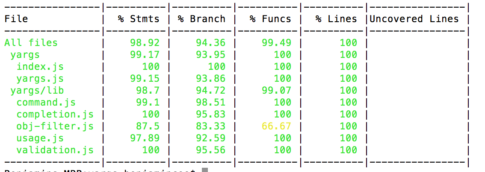

# Unit test
## 2.1 Unit test là gì?
- Định nghĩa: Unit test là quá trình kiểm thử từng phần nhỏ nhất của code, thường là từng function hoặc class/component.
- Mục đích:
  - Đảm bảo logic từng phần nhỏ nhất của code hoạt động đúng như mong đợi.
  - Phát hiện lỗi sớm, giúp giảm thiểu lỗi ở các phần khác của hệ thống.
  - Tăng cường sự tự tin khi thay đổi code, giúp dễ dàng refactor code mà không lo lỗi.

## 2.2 Một số nguyên tắc viết unit test hiệu quả
- Cấu trúc của 1 test case thường tuân thủ theo mô hình AAA:
  - **Arrange**: Chuẩn bị dữ liệu cần thiết cho test case.
  - **Act**: Thực thi hành động cần kiểm thử.
  - **Assert**: So sánh kết quả thực tế với kết quả mong đợi.

Ví dụ:

```ts
import { sum } from "../sum";

describe("sum function", () => {
  it("returns correct sum for positive numbers", () => {
    // Arrange
    const a = 2;
    const b = 3;
    const expected = 5;

    // Act
    const result = sum(2, 3);

    // Assert
    expect(result).toBe(5);
  });
});
```

- Quy tắc **FIRST** trong Unit Test:
  - **F**ast: Test case phải chạy nhanh.
  - **I**ndependent: Test case phải chạy độc lập.
  - **R**epeatable: Test case phải chạy giống nhau mỗi lần chạy.
  - **S**elf-validating: Test case phải tự đánh giá kết quả.
  - **T**imely: Viết đúng thời điểm, test case được viết ra trước khi viết code.

**Vi phạm nguyên tắc Repeatable (Có thể lặp lại)**

🔴 Ví dụ sai: Test này phụ thuộc vào thời gian thực (`Date.now()`), mỗi lần chạy có thể cho kết quả khác nhau.

```ts
test("should generate a unique order ID", () => {
  const orderId1 = `ORDER-${Date.now()}`;
  const orderId2 = `ORDER-${Date.now()}`;
  expect(orderId1).toBe(orderId2); // Lỗi vì thời gian thay đổi
});
```
✅ Cách viết đúng: [Mock](#) Date.now() để đảm bảo test chạy lại vẫn cho kết quả như nhau.

```ts
test("should generate a unique order ID", () => {
  const mockDateNow = jest.spyOn(Date, "now").mockReturnValue(0);
  const orderId1 = `ORDER-${Date.now()}`;
  const orderId2 = `ORDER-${Date.now()}`;
  expect(orderId1).toBe(orderId2); // Pass vì Date.now() trả về giá trị cố định
  mockDateNow.mockRestore();
});
```

**Vi phạm nguyên tắc Self-validating (Tự xác thực)**

🔴 Ví dụ sai: Test này không có bất kỳ expect() nào để xác thực kết quả, chỉ log ra console.

```ts
test("should return correct user data", async () => {
  const user = await fetchUser(1);
  console.log(user); // Không có kiểm tra kết quả
});
```
✅ Cách viết đúng: Sử dụng expect() để kiểm tra kết quả trả về.

```ts
test("should return correct user data", async () => {
  const user = await fetchUser(1);
  expect(user).toEqual({ id: 1, name: "Alice" });
});
```

## 2.3. Cách tổ chức file test và cấu trúc một file test
### 2.3.1. Cách tổ chức file test
Có khá nhiều cách tổ chức file test khác nhau, tùy thuộc vào framwork, cấu trúc dự án, dưới đây là một số cách tổ chức phổ biến

- Đặt theo tên file source, cùng thư mục với file source theo cấu trúc:
  - `<file-goc>.test.ts`
  - `<file-goc>.spec.ts`

Ví dụ:

```
lib/
  services/
    userService.ts
    userService.test.ts
  sum.ts
  sum.test.ts
```

- Đặt trong thư mục `__tests__` hoặc `test`, với cấu trúc thư mục tương tự với các file source.

```
lib/
  __tests__/
    sum.test.ts
    services/
      userService.test.ts
  sum.ts
  services/
    userService.ts
```

- Đặt tên theo thư mục cha của file source code.
```
lib/
  __tests__/
    sum.test.ts
  sum.ts
  services/
    __tests__/
      userService.test.ts
    userService.ts
```

### 2.3.2. Cấu trúc một file test
Cấu trúc một file test thường bao gồm:
- Import các thư viện cần thiết.
- Import file cần kiểm thử.
- Viết các test case.

1. Hàm `test()` và `it()`
- `test()` thường dùng trong cách cách viết truyền thống.

Ví dụ:
```ts
test('adds two numbers correctly', () => {
  expect(1 + 2).toBe(3);
});
```

- `it()` cách viết tập trung hơn vào hành vi, thường dùng trong cách viết BDD (Behavior-Driven Development).

Ví dụ:
```ts
it('should add two numbers correctly', () => {
  expect(1 + 2).toBe(3);
});
```

Mô tả bên trong `it` và `test` nên mô tả rõ hành vi của test case, sử dụng ngôn ngữ sát với tự nhiên nhất có thể, không nên mô tả cách code hoạt động.

❌ Bad:
```ts
it('calls handleSubmit and sets state to loading')
it('handles input')
it('success')
it('displays a loading indicator when the form is submitted')
```

✅ Good:
```ts
it('should submit the form and set the loading state') // Mô tả về hành vi mong đợi thay vì mô tả chi tiết cách code hoạt động
it('should display the user input')
it('should display a success message')
// Dùng describe() để mô tả trương hợp test, it để mô tả test case
discribe('when the form is submitted', () => {
  it('should display a loading indicator')
})
```

2. `describe()`: Sử dụng `describe()` để nhóm các test case liên quan lại với nhau. `describe()` có thể dùng để mô tả cho một hàm, một module, một component, một API, một class, một nhóm test case, một trường hợp test. `describe()` có thể chứa nhiều `describe()` khác bên trong.

  Ví dụ:

  ```ts
  // math.test.ts
  import Math from "../math";

  describe("Math", () => {
    describe("#sum", () => {
      test("returns correct sum for positive numbers", () => {
        expect(sum(2, 3)).toBe(5);
      });

      test("returns correct sum for negative numbers", () => {
        expect(sum(-2, -3)).toBe(-5);
      });

      test("returns correct sum for mixed numbers", () => {
        expect(sum(-2, 3)).toBe(1);
      });
    });
  });
  ```

  **💡 TIP:**
    - Sử dụng prefix `#` để mô tả các **instance method** của một class hoặc **property** của một object.
    - Sử dụng prefix `.` để mô tả các **static method** của một class hoặc **static property** của một object.

  Ví dụ 2:

  ```ts
  describe("Number", () => {
    describe("#toString()", () => {
      // Các test case liên quan đến hàm .toString()
    });

    describe("#toFixed()", () => {
      // Các test case liên quan đến hàm .toFixed()
    });

    describe(".parseInt", () => {
      // Các test case liên quan đến hàm Number.parseInt()
    });

    describe(".isNaN", () => {
      // Các test case liên quan đến hàm Number.isNaN()
    });

    describe(".MAX_VALUE", () => {
      // Các test case liên quan đến static property Number.MAX_VALUE
    });
  });
  ```

3. **expect()**: kết hợp với các matcher để so sánh kết quả thực tế với kết quả mong đợi.

Ví dụ một số matcher phổ biến:

```ts
expect(1 + 4).toBe(5); // So sánh bằng
expect({ id: 1 }).toEqual({ id: 1 }); // So sánh deep equal
expect([1, 2, 3]).toContain(2); // Kiểm tra phần tử có tồn tại trong mảng
expect("hello").toMatch(/hello/); // Kiểm tra chuỗi có match với regex
expect(() => { throw new Error("error") }).toThrow("error"); // Kiểm tra hàm có throw error
```

- Các matchers của Jest: https://jestjs.io/docs/using-matchers
- Thư viện matchers phổ biến: https://www.chaijs.com

4. **beforeEach()** và **afterEach()**: Dùng để chạy một hàm trước mỗi test case hoặc sau mỗi test case.

```ts
let users = [];

// Reset users trước mỗi test case
beforeEach(() => {
  users = [{ id: 1, name: "Alice" }, { id: 2, name: "Bob" }];
});

it("should be able to add a new user", () => {
  users.push({ id: 3, name: "Charlie" });
  expect(users).toHaveLength(3);
});

it("should be able to remove a user", () => {
  users.pop();
  expect(users).toHaveLength(1);
});
```

5. **beforeAll()** và **afterAll()**: Dùng để chạy một hàm trước tất cả các test case hoặc sau tất cả các test case.

6. Mocking

Xét tình huống sau, bạn có một hàm `registerUser()` cần test. Công việc của hàm này bao gồm việc xác thực dữ liệu, insert dữ liệu vào database, gửi email xác nhận,... Bạn sẽ không muốn trong quá trình test hàm này liên tục gửi email xác nhận, thậm chí là insert dữ liệu vào database. Ngoài ra, kể cả khi bạn không thấy vấn đề gì với việc nhận email liên tục, việc gửi email trong quá trình test sẽ làm chậm quá trình chạy test của bạn, và bạn cũng không thể test được trường hợp lỗi khi email không gửi được.

Để giải quyết những vấn đề này, bạn có thể sử dụng mock để giả lập các hàm phụ thuộc, giả lập dữ liệu trả về, giả lập hành vi của hàm phụ thuộc.

> Mocking là kỹ thuật giả lập một hàm hoặc module khác để kiểm thử mà không cần phụ thuộc vào hàm hoặc module thật.

Sử dụng mock giúp test nhanh hơn, không phụ thuộc vào các hàm hoặc module khác, giúp kiểm thử các trường hợp edge case mà khó tái tạo trong môi trường thực.

Ví dụ áp dụng mock để test function sau:

```ts
function handlePageLoad(productId) {
  return fetchProduct(productId)
    .then((data) => data.product)
    .catch(redirectToPageNotFound);
}
```

Vấn đề khi test function trên là phụ thuộc vào hàm `fetchProduct` và `redirectToPageNotFound`, để test đủ các trường hợp cần phải mock 2 hàm này.

```ts
import { handlePageLoad } from "~/pages/Product.vue";

describe("ProductPage", () => {
  describe("when product is loaded", () => {
    it("should return product data", async () => {
      const product = { id: 1, name: "Product 1" };
      jest.spyOn(ProductPage.methods, "fetchProduct").mockResolvedValue({ product });

      const data = await ProductPage.handlePageLoad(1);

      expect(data).toEqual(product);
    });
  });

  describe("when product is not found", () => {
    it("should redirect to 404 page", async () => {
      jest.spyOn(ProductPage.methods, "fetchProduct").mockRejectedValue(new Error("Not found"));
      const redirectToPageNotFound = jest.fn();

      await ProductPage.handlePageLoad(1);

      expect(redirectToPageNotFound).toHaveBeenCalled();
    });
  });
});
```

Giải thích:
- Sử dụng `jest.spyOn()` để mock hàm `fetchProduct` và `redirectToPageNotFound`.
- Sử dụng `mockResolvedValue()` để giả lập hàm trả về giá trị mong muốn.
- Sử dụng `mockRejectedValue()` để giả lập hàm trả về lỗi.
- Sử dụng `jest.fn()` để tạo một mock function.

**🎯 Khi nào dùng `jest.fn()` và `jest.spyOn()`?**
- Dùng jest.fn() (stub function) khi muốn tạo một hàm giả lập từ đầu, hoàn toàn thay thế logic gốc (thường dùng để mock API, database, hoặc callback).
- Dùng jest.spyOn() (spy function) khi muốn theo dõi một hàm có sẵn mà không cần thay đổi hoàn toàn logic (thường dùng để kiểm tra console, gọi API, gọi method của class...), vẫn có thể thay đổi giá trị trả về bằng `mockResolvedValue()` hoặc `mockRejectedValue()` hoặc `mockReturnValue()`.

## 2.4. Integration test (Component test)

### 2.4.1. Cài đặt

Để cài đặt Vitest vào một dự án có sẵn, đầu tiên là cài đặt vitest và các dependencies cần thiết:

```sh
npm install -D vitest happy-dom @testing-library/vue
```

Hoặc với dự án React

```sh
npm install -D vitest happy-dom @testing-library/react
```

Có thể sử dụng happy-dom hoặc jest-dom, tùy thuộc vào yêu cầu của dự án.

Tiếp theo cài đặt Vitest configuation

```ts
// vitest.config.ts
import { defineConfig } from 'vite'

export default defineConfig({
  // ...
  test: {
    // enable jest-like global test APIs
    globals: true,
    // simulate DOM with happy-dom
    // (requires installing happy-dom as a peer dependency)
    environment: 'happy-dom'
  }
})
```

Tips: Nếu sử dụng typescript, thêm `vitest/globals` vào `types` trong `tsconfig.json` để sử dụng global test APIs.

```json
{
  "compilerOptions": {
    "types": ["vitest/globals"]
  }
}
```

Cập nhật file `package.json` để thêm script test

```json
{
  "scripts": {
    "test": "vitest",
    "test:watch": "vitest --watch",
    "test:coverage": "vitest --coverage"
  }
}
```

Sau đó chạy test lệnh

```sh
npm run test
```

### 2.4.2. React component
- Sử dụng `@testing-library/react` để test React component.

```ts
import {render, screen} from '@testing-library/react'
import userEvent from '@testing-library/user-event'
import '@testing-library/jest-dom'
import Fetch from './fetch'

test('loads and displays greeting', async () => {
  // ARRANGE
  render(<Fetch url="/greeting" />)

  // ACT
  await userEvent.click(screen.getByText('Load Greeting'))
  await screen.findByRole('heading')

  // ASSERT
  expect(screen.getByRole('heading')).toHaveTextContent('hello there')
  expect(screen.getByRole('button')).toBeDisabled()
})
```

Cheatsheet: https://testing-library.com/docs/react-testing-library/cheatsheet

### 2.4.3. Vue component

- Sử dụng `@testing-library/vue` để test Vue component.

Ví dụ test component Counter.vue:

```vue
<template>
  <div>
    <p>Times clicked: {{ count }}</p>
    <button @click="increment">increment</button>
  </div>
</template>

<script>
  export default {
    data: () => ({
      count: 0,
    }),

    methods: {
      increment() {
        this.count++
      },
    },
  }
</script>
```

```ts
import {render, fireEvent, screen} from '@testing-library/vue'
import Component from './Component.vue'

test('increments value on click', async () => {
  render(Component)

  // screen has all queries that you can use in your tests.
  // getByText returns the first matching node for the provided text, and
  // throws an error if no elements match or if more than one match is found.
  screen.getByText('Times clicked: 0')

  const button = screen.getByText('increment')

  // Dispatch a native click event to our button element.
  await fireEvent.click(button)
  await fireEvent.click(button)

  screen.getByText('Times clicked: 2')
})
```

Ví dụ test v-model

```vue
<template>
  <div>
    <p>Hi, my name is {{ user }}</p>

    <label for="username">Username:</label>
    <input v-model="user" id="username" name="username" />
  </div>
</template>

<script>
  export default {
    data: () => ({
      user: 'Alice',
    }),
  }
</script>
```

```ts
import {render, fireEvent, screen} from '@testing-library/vue'
import Component from './Component.vue'

test('properly handles v-model', async () => {
  render(Component)

  // Asserts initial state.
  screen.getByText('Hi, my name is Alice')

  // Get the input DOM node by querying the associated label.
  const usernameInput = screen.getByLabelText(/username/i)

  // Updates the <input> value and triggers an `input` event.
  // fireEvent.input() would make the test fail.
  await fireEvent.update(usernameInput, 'Bob')

  screen.getByText('Hi, my name is Bob')
})
```

Cheatsheet: https://testing-library.com/docs/vue-testing-library/cheatsheet

### 2.4.4. Best practices

- **Render the component**: Sử dụng `render()` để render component cần test. Đối với Vue component, không nên sử dụng `shallowMount`.
- Thêm thuộc tính `data-testid` vào các element cần test để dễ dàng query.

## 2.5. Snapshot testing
### 2.5.1. 📌 Snapshot testing là gì?

Snapshot Testing là một kỹ thuật kiểm thử giúp bắt giữ trạng thái của UI hoặc dữ liệu tại một thời điểm cụ thể và so sánh nó với các lần chạy test sau. Nếu snapshot thay đổi, test sẽ thất bại, yêu cầu xác nhận xem thay đổi đó có hợp lệ không.

### 2.5.2. 🎯 Khi nào nên dùng Snapshot Testing

✅ Kiểm tra giao diện component React/Vue để phát hiện thay đổi không mong muốn.
✅ Kiểm thử output của một hàm trả về chuỗi JSON hoặc HTML.
✅ Giữ trạng thái ổn định cho các cấu trúc dữ liệu phức tạp.
🚫 Không nên dùng khi dữ liệu có thể thay đổi theo thời gian (ví dụ: ngày giờ, ID ngẫu nhiên).

### 2.5.3. 📝 Cách hoạt động của Snapshot Testing

1. **Tạo snapshot**: Lần chạy đầu tiên, snapshot sẽ được tạo ra và lưu lại trong thư mục `__snapshots__`.
2. **So sánh snapshot**: Mỗi lần chạy test sau, snapshot mới sẽ được so sánh với snapshot cũ. Nếu có sự thay đổi, test sẽ fail.
3. **Xác nhận snapshot**: Nếu thay đổi là hợp lệ, bạn có thể update snapshot bằng cách chạy test với option `--updateSnapshot`.

### 2.5.4. 📚 Cách sử dụng Snapshot Testing

1. **React**: Sử dụng `@testing-library/react` và `vitest` để test React component.

```ts
import { render } from "@testing-library/react";
import { expect, it } from "vitest";
import App from "./App";

it("toUpperCase", () => {
  const { asFragment } = render(<App />);
  expect(asFragment()).toMatchSnapshot();
});
```

Đoạn test trên sẽ render component `<App />` sau đó caputure output dưới dạng snapshot. Ở lần run test đầu tiên, vitest sẽ generate ra một snapshot file chưa HTML đã render. Ở các lần run test sau, vitest sẽ so sánh snapshot mới với snapshot cũ.

2. **Vue**: Sử dụng `@testing-library/vue` để test Vue component.

```ts
import { render } from "@testing-library/vue";
import { expect, it } from "vitest";
import App from "./App.vue";

it("toUpperCase", () => {
  const { baseElement } = render(App);
  expect(baseElement).toMatchSnapshot();
});
```

## 2.6. Code coverage
### 2.6.1. 📌 Code Coverage là gì?
Code Coverage (Độ phủ mã) là thước đo cho biết bao nhiêu phần trăm code của bạn đã được kiểm tra bằng test. Mục tiêu của code coverage là đảm bảo rằng tất cả các nhánh logic quan trọng trong code đều được kiểm thử.

### 2.6.2. 📊 Các loại Code Coverage phổ biến
1. **Statement coverage**: Đo lường số lượng câu lệnh trong code đã được thực thi.

Ví dụ:
```ts
function sum(a, b) {
  if (a > 0) {      // statement 1
    return a + b;   // statement 2
  }
  return b;         // statement 3
}
```

2. **Branch coverage**: Đo lường số lượng nhánh logic trong code đã được thực thi. Bao gồm:
   - **Branch**: Một nhánh logic là một điều kiện hoặc lựa chọn trong code.
   - **Decision point**: Một điểm quyết định là một điều kiện hoặc lựa chọn trong code.

Ví dụ:

```ts
function sum(a, b) {
  if (a > 0) {      // Branch 1
    return a + b;   // Decision point 1
  }
  return b;         // Branch 2
}
```

3. **Function coverage**: Đo lường số lượng function trong code đã được thực thi.

Ví dụ:

```ts
function sum(a, b) {        // Function 1
  return a + b;
}

function subtract(a, b) {   // Function 2
  return a - b;
}
```

4. **Line coverage**: Đo lường số lượng dòng code đã được thực thi.

Ví dụ:

```ts
function sum(a, b) {        // Line 1
  return a + b;            // Line 2
}
```

### 2.6.3. Ví dụ minh họa




### 2.6.4. 🎯 Những lưu ý quan trọng về Code Coverage
- ✅ Code Coverage cao không đảm bảo chất lượng test tốt. Test cần kiểm thử cả logic, edge case, hành vi người dùng.
- ✅ Mức coverage khuyến nghị:
  - 80% trở lên cho unit test.
  - 60-70% cho integration test.
  - E2E test không cần quá cao, quan trọng là mô phỏng đúng hành vi người dùng.
- ✅ Không nên chạy theo 100% coverage → Quan trọng nhất là kiểm thử đúng logic, chứ không phải chỉ đảm bảo số liệu.
